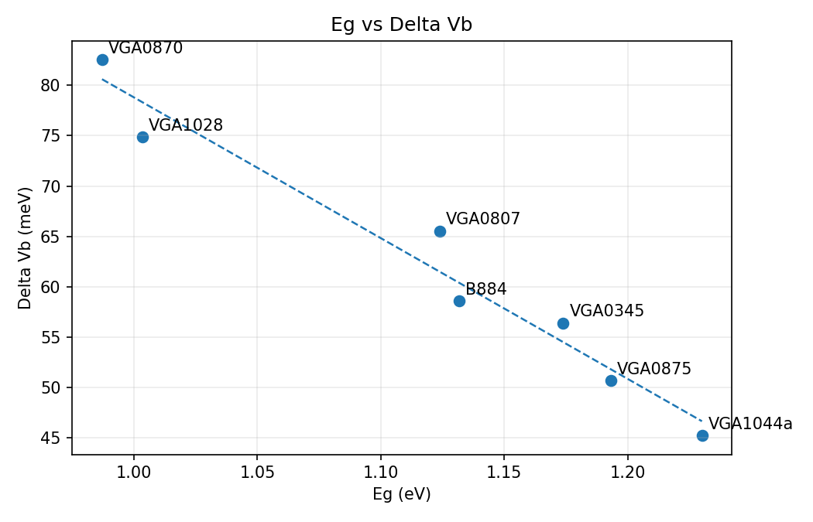
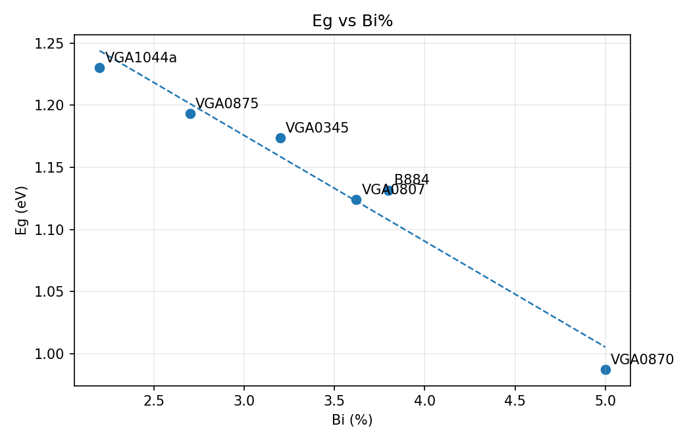
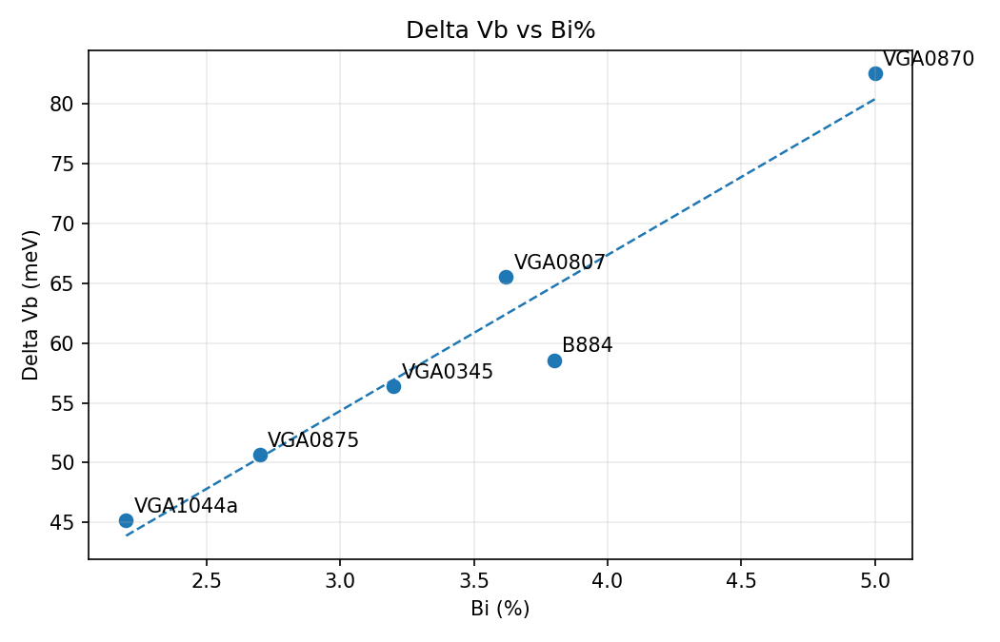

# MM Differential Decomposition for GaAsBi

Tools for reading J.A. Woollam CompleteEASE/VASE Mueller-matrix `.dat` exports,
performing logarithmic Mueller decomposition, detecting LD/LB spectral
features, estimating GaAsBi bandgap and valence-band splitting candidates, and
saving accepted results to a shared Git-friendly database.

## Files

- `mueller_decomposition_gui.py` - Tkinter GUI for analysis, result selection,
  database saving, and GitHub push.
- `differential_decomposition.py` - decomposition, feature detection, fitting,
  plotting, and reporting logic.
- `split_transition_fit.py` - command-line analysis entry point.
- `shared_results_database.py` - JSONL/CSV shared database and comparison plots.
- `selected_results.jsonl` - canonical shared accepted-results database.
- `selected_results.csv` - spreadsheet export regenerated from JSONL.
- `comparisons/` - generated comparison plots and summaries.

## Setup

```bash
python3 -m pip install -r requirements.txt
```

Tkinter is also required. On Debian/Ubuntu systems, install it with:

```bash
sudo apt install python3-tk
```

## Run The GUI

```bash
python3 mueller_decomposition_gui.py
```

Typical workflow:

1. Select a Woollam `.dat` file.
2. Run the analysis.
3. Inspect the `Results`, `Results Panel`, `Splitting`, and plots.
4. In the `Database` tab, choose or manually edit the accepted `Eg` and
   `Delta Vb`.
5. Enter `Bi %` when known.
6. Click `Save Selected Result` or `Save + Push to GitHub`.

## Shared Database

The database is intentionally plain text for GitHub:

- `selected_results.jsonl` is the source of truth.
- `selected_results.csv` is regenerated for spreadsheet use.
- `comparisons/eg_vs_delta_vb.png`
- `comparisons/eg_vs_bi_percent.png`
- `comparisons/delta_vb_vs_bi_percent.png`
- `comparisons/comparison_summary.csv`

The app's GitHub push uses your local Git authentication. It does not store
tokens or passwords.

## Notes

Raw `.dat` measurements and generated per-sample result folders are ignored by
default. Commit accepted database records and comparison outputs, not the raw
measurement files, unless there is a deliberate reason to share them.

<!-- comparison-plots:start -->
## Current Comparison Plots

Records in database: `7`

These plots are regenerated by the app from `selected_results.jsonl`.

### Eg vs Delta Vb



### Eg vs Bi%



### Delta Vb vs Bi%



Summary table: [`comparisons/comparison_summary.csv`](comparisons/comparison_summary.csv)
<!-- comparison-plots:end -->
